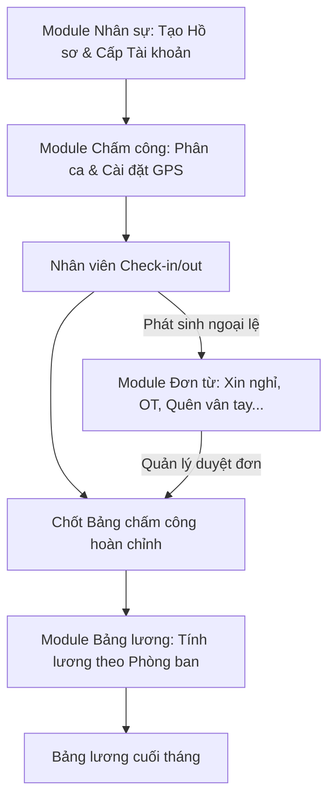

# 03 — Luồng nghiệp vụ cốt lõi (Core Business Flow)

Sau buổi họp với khách hàng, hệ thống HRM được chốt lại xoay quanh **4 module chính** với luồng dữ liệu chạy xuyên suốt và logic lệ thuộc nhau theo trình tự: **Nhân sự $\rightarrow$ Chấm công $\rightarrow$ Đơn từ $\rightarrow$ Bảng lương**.

## Trình tự Nghiệp vụ Tổng thể (End-to-End Flow)

### Bước 1: Nhân sự (Employees) - Điểm khởi đầu
- **Tạo Hồ sơ**: Quản trị viên (HR) truy cập module Nhân sự để tạo Hồ sơ nhân sự mới (nhập các thông tin cá nhân, phòng ban, vị trí).
- **Cấp tài khoản**: Sau khi có hồ sơ, HR tiến hành cấp tài khoản đăng nhập (User Account) và gắn vào hồ sơ đó để nhân viên có thể sử dụng app/web.

### Bước 2: Chấm công (Attendance) - Thiết lập & Ghi nhận
- **Thiết lập & Phân ca**: Quản lý / HR vào module Chấm công để thực hiện phân ca làm việc cho nhân viên và gán vị trí định vị (GPS) được phép chấm công.
- **Ghi nhận giờ công**: Hàng ngày, nhân viên sử dụng tài khoản được cấp để chấm công (Check-in / Check-out) tại vị trí GPS đã cài đặt. Dữ liệu thô này hình thành nên bảng chấm công sơ bộ.

### Bước 3: Đơn từ (Applications) - Điều chỉnh & Xử lý ngoại lệ
- **Phát sinh Đơn từ**: Trong quá trình làm việc sẽ có các ngoại lệ (VD: đi trễ, quên chấm công, xin nghỉ phép, xin làm thêm giờ). Nhân viên sẽ vào module Đơn từ để tạo các loại đơn tương ứng.
- **Duyệt đơn**: Quản lý trực tiếp / HR tiến hành phê duyệt. 
- **Kết quả (Output)**: 
  - Một danh sách Đơn từ hoàn chỉnh (đã chốt duyệt).
  - Các đơn từ đã duyệt sẽ TỰ ĐỘNG CẬP NHẬT ngược lại vào module Chấm công (VD: bù giờ, trừ phép, ghi nhận làm thêm), từ đó chốt ra được **Bảng chấm công hoàn chỉnh (Final Timesheet)**.

### Bước 4: Bảng lương (Payroll) - Đích đến cuối cùng
- **Tính toán Lương**: Cuối tháng, Admin truy cập module Bảng lương và bấm **"Tạo bảng lương"**.
- **Xử lý Đa dạng (Đặc tả quan trọng)**: Hệ thống sẽ lấy dữ liệu từ *Bảng chấm công hoàn chỉnh* để tính toán. Do **mỗi phòng ban có cách tính lương khác nhau** (công thức, phụ cấp, KPI riêng), hệ thống phải hỗ trợ áp dụng công thức linh hoạt theo từng phòng ban.
- **Kết quả (Output)**: Bảng lương chi tiết cuối tháng sẵn sàng để thanh toán.

---

## Tóm tắt Luồng Dữ liệu (Data Flow)

